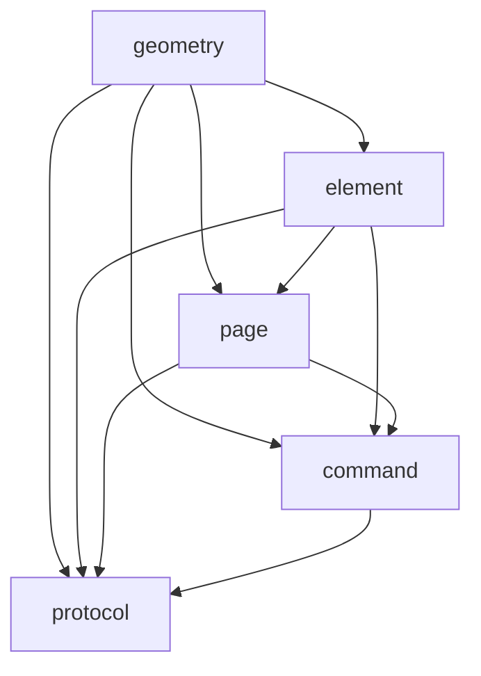

# 白板库总览（hrtc_whiteboard）

本目录（`src/Whiteboard`）是白板**数据层静态库** `hrtc_whiteboard` 的源码与文档：

- **数据层**：白板元素（笔画、页面）的内存模型与操作逻辑（绘制、橡皮擦、变换、历史快照），不含任何网络或 UI 依赖。
- **命令层**：白板网络命令的纯数据结构定义（命令是普通数据，序列化逻辑在协议层）。
- **协议层**：基于 msgpack 的命令/元素序列化与反序列化（网络二进制 ↔ 内存对象）。

对外依赖仅 `msgpack-cxx`（见 [CMakeLists.txt](../CMakeLists.txt)）：

```cmake
add_library(hrtc_whiteboard STATIC ${WHITEBOARD_SRC})
target_link_libraries(hrtc_whiteboard PUBLIC msgpack-cxx)
```

## 目录结构

| 目录 | 职责 | 文档 |
| --- | --- | --- |
| `geometry/` | 几何值类型：点、矩形、包围盒、线段、坐标变换 | [geometry.md](geometry.md) |
| `element/` | 元素模型：`Element` 基类、`Stroke` 笔画、工厂注册 | [element.md](element.md) |
| `page/` | 页面：元素管理、橡皮擦裁剪、深拷贝、坐标转换 | [page.md](page.md) |
| `command/` | 命令体系：18 个网络命令的纯数据结构 + 工厂注册 | [command.md](command.md) |
| `protocol/` | msgpack 编解码：线格式、geometry 适配器、命令/元素序列化 | [protocol.md](protocol.md) |

## 聚合头文件

| 头文件 | 内容 |
| --- | --- |
| `Whiteboard/whiteboard.h` | 数据层聚合头：geometry + element + page 全部类型 |
| `Whiteboard/protocol/protocol.h` | 协议层聚合头：geometry 适配器 + `Extend` + 元素/命令编解码 |

## 模块依赖关系



要点：

- `command` / `page` / `element` 只依赖 `geometry` 与彼此，不感知序列化。
- `protocol` 位于最上层，聚合所有类型；geometry 的 msgpack 适配器放在协议层，数据类本身不引入 msgpack。

## 典型使用流

一次完整的"远程笔画同步"数据流：

```cpp
// 1. 操作端构造命令（普通数据，无序列化逻辑）
whiteboard::StrokeEnd cmd;
cmd.pageId   = "page-1";
cmd.strokeId = "s-42";
cmd.points   = points;

// 2. 序列化为网络二进制
std::string wire = whiteboard::protocol::SerializeCommand(cmd);

// 3. 经网络传输到远端……

// 4. 远端反序列化回命令对象
auto received = whiteboard::protocol::DeserializeCommand(wire);

// 5. 应用到本地数据层 Page（UI 层组装 Stroke 后追加）
if (auto* strokeCmd = dynamic_cast<whiteboard::StrokeEnd*>(received.get())) {
    whiteboard::Stroke stroke;
    stroke.id     = strokeCmd->strokeId;
    stroke.points = strokeCmd->points;
    page.Append(stroke);
}
```

同理，全量同步使用 `FullSync` 命令携带 `std::vector<Page>`，元素级同步使用 `ElementAdd`/`ElementRemove`。详见 [command.md](command.md) 与 [protocol.md](protocol.md)。

## 扩展点

库内置类型之外，可通过工厂注册扩展新类型：

- 元素：`whiteboard::RegisterElementFactory(type, factory)` → 反序列化时按类型名重建
- 命令：`whiteboard::RegisterCommandFactory(type, factory)` → `DeserializeCommand` 按类型名创建

扩展指引见 [element.md](element.md) 与 [command.md](command.md)。
